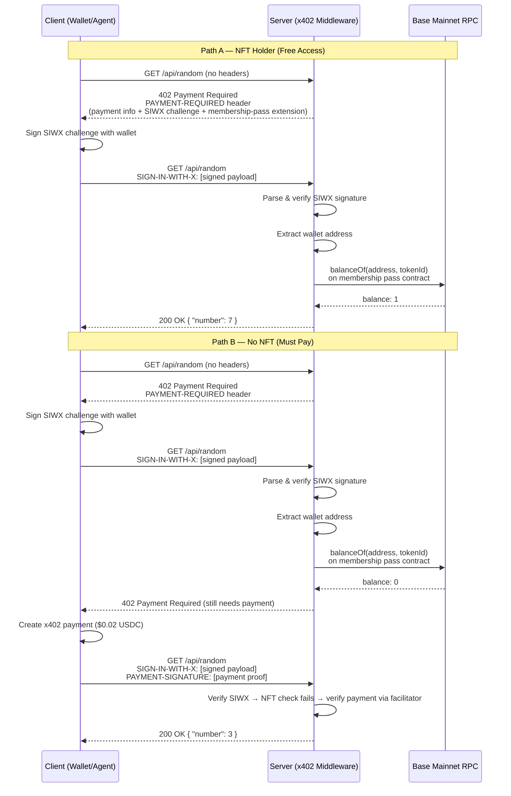

## What This Example Does

This is an API endpoint (`GET /api/random`) that returns a random number between 1 and 9. The twist: it's behind a paywall — $0.02 USDC per request, enforced by the x402 protocol. But if you hold a specific membership pass NFT in your wallet, you get in for free. No payment, no credits, no API key. You just prove you own the NFT by signing a message with your wallet, and the server lets you through. Think of the NFT as a membership card — flash it at the door and you skip the line.

## Why Build This?

The membership pass pattern solves a real problem: how do you give special access to a group of people without managing usernames, passwords, or API keys? The NFT *is* the credential. The blockchain *is* the database. You don't need to maintain a list of members — you just check the chain.

Here's where this pattern shows up in the real world:

- **Paid API with a loyalty tier.** You run a data API that charges per request. Users who hold your project's NFT get unlimited free access — it's your way of rewarding early supporters or premium subscribers.

- **Gated content for NFT communities.** You're building a tool for an NFT collection (analytics, rarity checker, AI features). Holders of the collection get it free. Everyone else pays per use. The NFT is already the membership — you don't need a separate auth system.

- **Freemium for DAO members.** Your DAO ships developer tools. Members (identified by a governance NFT or token) get free access. Non-members can still use the tools, they just pay. This lets you monetize externally while keeping the community happy.

The key insight: SIWX lets you identify *who* is calling your API (which wallet), and the on-chain NFT check tells you *what access they should get*. x402 handles the payment fallback for everyone else. You get a two-tier system with zero user accounts.

## Architecture

Here's the full request flow. Two paths through the system — one for members (NFT holders), one for everyone else:



Notice the two different networks at play: the NFT ownership check hits **Base mainnet** (where the NFT lives), while the x402 payment happens on **Base Sepolia** (testnet, for this demo). They're completely independent on-chain interactions.

## Setup

### Prerequisites

- **Node.js** 18+ (20+ recommended)
- **A wallet with the membership pass NFT** on Base mainnet (for testing free access)
- **A wallet with testnet USDC** on Base Sepolia (for testing paid access) — get test USDC from the [Base Sepolia faucet](https://faucet.circle.com/)
- **git** and **npm**

### Step 1: Clone the project

```bash
git clone https://github.com/Must-be-Ash/siwx-membership-pass.git
cd siwx-membership-pass
```

### Step 2: Install dependencies

```bash
npm install
```

### Step 3: Configure environment variables

Create a `.env.local` file in the project root:

```env
# Wallet that holds the membership pass NFT (gets free access)
X402_WALLET_ADDRESS=0xYourNFTHolderAddress
X402_WALLET_PRIVATE_KEY=0xYourPrivateKey

# Wallet without the NFT but with USDC (for testing paid access)
NON_ALLOWLISTED_WALLET_ADDRESS=0xYourPayerAddress
NON_ALLOWLISTED_WALLET_PRIVATE_KEY=0xPayerPrivateKey

# Membership pass NFT contract on Base mainnet
MEMBERSHIP_NFT_ADDRESS=0xE7D4DE14e1e5bBC50BE8b0905a056beC56BE7B66
MEMBERSHIP_RPC_URL=https://mainnet.base.org
```

Here's what each variable does:

| Variable | Purpose |
|----------|---------|
| `X402_WALLET_ADDRESS` | The wallet used in tests that holds the membership NFT. This wallet gets free access. |
| `X402_WALLET_PRIVATE_KEY` | Private key for the above wallet. Used to sign SIWX challenges in tests. |
| `NON_ALLOWLISTED_WALLET_ADDRESS` | A second wallet that does *not* hold the NFT. Used to test the payment path. |
| `NON_ALLOWLISTED_WALLET_PRIVATE_KEY` | Private key for the payer wallet. Needs testnet USDC on Base Sepolia. |
| `MEMBERSHIP_NFT_ADDRESS` | The ERC-1155 contract address to check for membership. Default is the Nyan Dot Cat contract on Base. |
| `MEMBERSHIP_RPC_URL` | RPC endpoint for the chain where the NFT lives. Default is Base mainnet public RPC. |

### Step 4: Start the server

```bash
npm run dev
```

You should see:

```
▲ Next.js 16.x (Turbopack)
- Local: http://localhost:3000
```

### Step 5: Test the 402 response

```bash
curl -i http://localhost:3000/api/random
```

Expected output:

```
HTTP/1.1 402 Payment Required
content-type: application/json
payment-required: eyJ4NDAyVmVyc2lvbi...
```

You got a 402. The server is saying: "pay up or prove you're a member." The `payment-required` header contains everything the client needs to know — payment options, SIWX challenge, and the membership pass extension info. We'll decode that header in a later section.

### Step 6: Run the test suite

```bash
npm test
```

This runs all 5 tests:

```
PASS Test 1: 402 + membership-pass extensions
PASS Test 2: Payment blocked without SIWX
PASS Test 3: NFT holder free access
PASS Test 4: Empty wallet needs payment
PASS Test 5: Payer wallet SIWX + payment
```

For a quick single-wallet membership check:

```bash
npm run test:quick
```

## The Middleware — How It All Works

Everything happens in `middleware.ts`. Let's walk through it section by section.

### x402 Setup (the standard plumbing)

This part is the same in every x402 project. You set up a facilitator client (the service that verifies payments), register the payment scheme (EVM on Base Sepolia), and plug in the SIWX extension:

```typescript
const facilitatorClient = new HTTPFacilitatorClient({
  url: "https://x402.org/facilitator",
});

const resourceServer = new x402ResourceServer(facilitatorClient)
  .register("eip155:84532", new ExactEvmScheme())
  .registerExtension(siwxResourceServerExtension);
```

### Route Configuration (what the 402 advertises)

This is where you define what the server tells clients in the 402 response. It's the "menu" — here's what you can pay, here's how to sign in, and here's the membership pass info:

```typescript
const routes = {
  "/api/random": {
    accepts: [
      {
        scheme: "exact" as const,
        price: "$0.02",
        network: "eip155:84532" as const,
        payTo,
      },
    ],
    description: "Get a random number 1-9",
    mimeType: "application/json",
    extensions: {
      ...declareSIWxExtension({
        statement: "Sign in to verify membership NFT ownership for free access",
        expirationSeconds: 300,
      }),
      "membership-pass": {
        description: "Hold a Nyan Dot Cat NFT on Base mainnet for free access",
        network: "eip155:8453",
        nftContract: "0xE7D4DE14e1e5bBC50BE8b0905a056beC56BE7B66",
        nftName: "Nyan Dot Cat",
        standard: "ERC-1155",
        rule: "balanceOf >= 1",
      },
    },
  },
};
```

The `accepts` array tells clients: "you can pay $0.02 USDC on Base Sepolia." The `extensions` object adds two things:

1. **`sign-in-with-x`** — the SIWX challenge. This tells the client: "I support wallet sign-in. Here's a nonce to sign."
2. **`membership-pass`** — custom metadata that tells the client: "if you hold this NFT on this network, you get in free." This is purely informational for the client — the server does the actual check.

### The NFT Check (the star of the show)

This is what makes this example unique. A viem public client talks to Base mainnet and calls `balanceOf` on the membership pass ERC-1155 contract:

```typescript
const nftClient = createPublicClient({
  chain: base,
  transport: http(process.env.MEMBERSHIP_RPC_URL || "https://mainnet.base.org"),
});

const NFT_ADDRESS = (process.env.MEMBERSHIP_NFT_ADDRESS ||
  "0xE7D4DE14e1e5bBC50BE8b0905a056beC56BE7B66") as `0x${string}`;

const MEMBERSHIP_TOKEN_ID = BigInt(process.env.MEMBERSHIP_TOKEN_ID || "1");
```

The `checkMembership` function does the on-chain read:

```typescript
async function checkMembership(
  address: string
): Promise<{ isMember: boolean; balance: number }> {
  const balance = await nftClient.readContract({
    address: NFT_ADDRESS,
    abi: ERC1155_ABI,
    functionName: "balanceOf",
    args: [address as `0x${string}`, MEMBERSHIP_TOKEN_ID],
  });

  return {
    isMember: balance > BigInt(0),
    balance: Number(balance),
  };
}
```

This calls `balanceOf(walletAddress, tokenId)` on the ERC-1155 contract. If the wallet holds at least 1 of the specified token, `isMember` is `true`. That's the entire gate logic — one on-chain read.

> **Why ERC-1155 and not ERC-721?** The membership pass contract happens to be ERC-1155, which uses `balanceOf(address, tokenId)` instead of ERC-721's `balanceOf(address)`. ERC-1155 supports multiple token types in a single contract, so you need to specify *which* token you're checking. If your NFT is ERC-721, swap the ABI to use the single-argument `balanceOf`.

### The Gate Hook (the decision maker)

The hook runs on every protected request, *before* x402 payment verification. It decides: should this request get free access, proceed to payment, or be blocked?

```typescript
function createMembershipGateHook() {
  return async (context) => {
    const siwxHeader = context.adapter.getHeader("sign-in-with-x");
    const hasPayment = !!context.adapter.getHeader("payment-signature");
```

First, check what headers the client sent. There are four possible combinations:

**No SIWX, no payment — first visit.** Return `undefined` to fall through to the standard 402 response. The client gets the "menu" with payment options and SIWX challenge.

```typescript
    if (!siwxHeader && !hasPayment) {
      return; // → 402 with extensions
    }
```

**Payment without SIWX — blocked.** The server requires wallet identity before accepting payment. This prevents anonymous payments (you need to know who's paying).

```typescript
    if (!siwxHeader && hasPayment) {
      return {
        abort: true as const,
        reason: "Sign in with your wallet first.",
      }; // → 403
    }
```

**SIWX present — validate and check membership.** This is the main path. Parse the SIWX header, verify the signature is valid, extract the wallet address, then check on-chain:

```typescript
    const payload = parseSIWxHeader(siwxHeader!);
    const resourceUri = context.adapter.getUrl();

    const validation = await validateSIWxMessage(payload, resourceUri);
    // ... check validation.valid

    const verification = await verifySIWxSignature(payload);
    // ... check verification.valid

    const address = verification.address!;
    const { isMember } = await checkMembership(address);
```

**Member — free access bypass.** If the wallet holds the NFT, return `{ grantAccess: true }`. This tells x402 to skip payment entirely and serve the endpoint response directly. No payment required, no facilitator involved.

```typescript
    if (isMember) {
      return { grantAccess: true as const }; // → 200 (free)
    }
```

**Not a member — fall through to payment.** Return `undefined` again. The request continues through the x402 payment verification flow. If the client also sent a `PAYMENT-SIGNATURE` header, the payment gets verified and the request succeeds. If not, they get another 402.

```typescript
    return; // → falls through to x402 payment check
```

### Wiring It Up

The hook is registered on the HTTP server with `onProtectedRequest`, and the whole thing is exported as Next.js middleware:

```typescript
const httpServer = new x402HTTPResourceServer(
  resourceServer,
  routes
).onProtectedRequest(createMembershipGateHook());

export const middleware = paymentProxyFromHTTPServer(httpServer);

export const config = {
  matcher: ["/api/:path*"],
};
```

Every request to `/api/*` goes through this middleware. The actual endpoint (`app/api/random/route.ts`) is blissfully unaware of payments, SIWX, or NFTs — it just returns a random number:

```typescript
export async function GET() {
  const number = Math.floor(Math.random() * 9) + 1;
  return NextResponse.json({ number });
}
```

## Understanding SIWX

### What SIWX Is

SIWX (Sign-In-With-X) is a wallet authentication standard based on [CAIP-122](https://github.com/ChainAgnostic/CAIPs/blob/main/CAIPs/caip-122.md). It lets a server verify that a client controls a specific wallet address — without passwords, API keys, or OAuth. The wallet signs a structured message, and the server verifies the signature cryptographically.

Think of it like showing your ID at the door. The bouncer (server) doesn't need to know your name in advance — they just need to see a valid ID (signed message) and check it against their list (the blockchain).

### Why SIWX Matters Here

In this example, SIWX solves a specific problem: the server needs to know *which wallet* is making the request so it can check if that wallet holds the membership NFT. Without SIWX, the server has no way to connect an HTTP request to a blockchain address.

The flow is:
1. Server says "prove who you are" (SIWX challenge in the 402 response)
2. Client signs the challenge with their wallet's private key
3. Server recovers the wallet address from the signature
4. Server checks that address on-chain for NFT ownership

No accounts. No API keys. No database of users. The wallet *is* the identity.

### Two Headers, Two Purposes

x402 with SIWX uses two separate headers, and they do very different things:

| Header | Purpose | When used |
|--------|---------|-----------|
| `SIGN-IN-WITH-X` | **Identity** — proves which wallet is making the request | Always (required by this server) |
| `PAYMENT-SIGNATURE` | **Payment** — proves the client authorized a $0.02 USDC transfer | Only when the wallet doesn't hold the NFT |

These can even come from *different wallets*. You could sign in with your NFT-holding wallet (for identity) and pay from a different wallet (for payment). In practice, most clients use the same wallet for both.

### The Challenge-Response Flow

Here's how SIWX works step by step:

**1. Server issues a challenge.** When the client first hits the endpoint, the server returns a 402 with a SIWX challenge embedded in the `payment-required` header. The challenge includes a unique nonce, a domain, a statement, and an expiration time.

**2. Client signs the challenge.** The client takes the challenge fields, constructs a [EIP-191](https://eips.ethereum.org/EIPS/eip-191) message, and signs it with their wallet's private key. This produces a signature that is cryptographically bound to the wallet address.

**3. Client sends the signed payload.** The signed SIWX message is base64-encoded and sent in the `SIGN-IN-WITH-X` header on the next request.

**4. Server verifies.** The server decodes the header, checks that the message fields match (domain, nonce, expiration), and recovers the wallet address from the signature. If everything checks out, the server now knows *exactly* which wallet made the request.

In code, the client side looks like this:

```typescript
import { createSIWxPayload, encodeSIWxHeader } from "@x402/extensions/sign-in-with-x";

// Get the SIWX challenge from the 402 response
const decoded = JSON.parse(atob(paymentRequiredHeader));
const siwxExt = decoded.extensions["sign-in-with-x"];
const chain = siwxExt.supportedChains[0];

// Sign it with your wallet
const payload = await createSIWxPayload(
  { ...siwxExt.info, chainId: chain.chainId, type: chain.type },
  walletAccount
);

// Encode for the header
const header = encodeSIWxHeader(payload);

// Send the request with the signed SIWX
const res = await fetch("/api/random", {
  headers: { "SIGN-IN-WITH-X": header },
});
```

## Anatomy of the 402 Response

When you `curl http://localhost:3000/api/random`, the server returns a 402 with a base64-encoded `payment-required` header. Here's what it looks like decoded:

```json
{
  "x402Version": 2,
  "error": "Payment required",
  "resource": {
    "url": "http://localhost:3000/api/random",
    "description": "Get a random number 1-9",
    "mimeType": "application/json"
  },
  "accepts": [
    {
      "scheme": "exact",
      "network": "eip155:84532",
      "amount": "20000",
      "asset": "0x036CbD53842c5426634e7929541eC2318f3dCF7e",
      "payTo": "0xF7C645b7600Fb6AaE07Fd0Cf31112A7788BE8F85",
      "maxTimeoutSeconds": 300,
      "extra": {
        "name": "USDC",
        "version": "2"
      }
    }
  ],
  "extensions": {
    "sign-in-with-x": {
      "info": {
        "domain": "localhost",
        "uri": "http://localhost:3000/api/random",
        "version": "1",
        "nonce": "60a92e1a7c40685b371a4aab5caa8182",
        "issuedAt": "2026-03-13T00:08:38.135Z",
        "expirationTime": "2026-03-13T00:13:38.135Z",
        "statement": "Sign in to verify membership NFT ownership for free access",
        "resources": ["http://localhost:3000/api/random"]
      },
      "supportedChains": [
        { "chainId": "eip155:84532", "type": "eip191" }
      ]
    },
    "membership-pass": {
      "description": "Hold a Nyan Dot Cat NFT on Base mainnet for free access",
      "network": "eip155:8453",
      "nftContract": "0xE7D4DE14e1e5bBC50BE8b0905a056beC56BE7B66",
      "nftName": "Nyan Dot Cat",
      "standard": "ERC-1155",
      "rule": "balanceOf >= 1"
    }
  }
}
```

Let's break this down:

### `accepts` — Payment options

```json
{
  "scheme": "exact",
  "network": "eip155:84532",
  "amount": "20000",
  "asset": "0x036CbD53842c5426634e7929541eC2318f3dCF7e",
  "payTo": "0xF7C645b7600Fb6AaE07Fd0Cf31112A7788BE8F85"
}
```

This tells the client: "If you want to pay, send exactly 20000 units (that's $0.02 — USDC has 6 decimals) of USDC on Base Sepolia to this address." The `scheme: "exact"` means it's a fixed price, not an auction or subscription.

### `extensions.sign-in-with-x` — The SIWX challenge

```json
{
  "domain": "localhost",
  "nonce": "60a92e1a7c40685b371a4aab5caa8182",
  "issuedAt": "2026-03-13T00:08:38.135Z",
  "expirationTime": "2026-03-13T00:13:38.135Z",
  "statement": "Sign in to verify membership NFT ownership for free access"
}
```

This is the challenge the client needs to sign. Key fields:

- **`nonce`** — a random value that prevents replay attacks. Each 402 response generates a fresh nonce.
- **`statement`** — human-readable text shown to the user when their wallet prompts for a signature. It explains *why* they're signing.
- **`expirationTime`** — the signature is only valid for 5 minutes (300 seconds, as configured in the middleware).
- **`supportedChains`** — which chain's signing scheme to use. `eip191` is the standard Ethereum personal_sign.

### `extensions.membership-pass` — The gate info

```json
{
  "description": "Hold a Nyan Dot Cat NFT on Base mainnet for free access",
  "network": "eip155:8453",
  "nftContract": "0xE7D4DE14e1e5bBC50BE8b0905a056beC56BE7B66",
  "standard": "ERC-1155",
  "rule": "balanceOf >= 1"
}
```

This is custom metadata for the client. It tells AI agents and wallets: "there's another way in — if you hold this NFT on Base mainnet, you don't need to pay." A smart client can read this, check if the user's wallet holds the NFT, and decide whether to sign in (for free access) or prepare a payment.

> **This extension is informational.** The server does the actual on-chain check — the client can't lie about holding an NFT. But advertising the gate info helps clients make better UX decisions (e.g., "You hold the membership NFT! Signing in for free access..." vs. "No NFT found. This will cost $0.02.").
